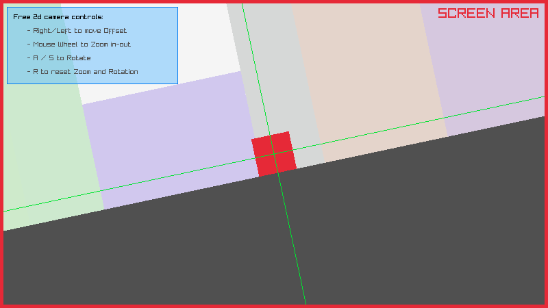

# Oberon-2 / Oxford Oberon Compiler bindings to raylib

## Description
This is a small project to provide usable multimedia and GUI capabilites to 
Oberon-2 programs compiled by the Oxford Oberon Compiler (OBC).

The ultimate goal is to have complete Oberon-2 interfaces to `raylib`, `raymath` and `raygui` for this compiler.

**Currently, only a small fraction of `raylib` API is bound. This project is a Work In Progress.**

## Differences VS original C API
While most of the bindings has been designed to mimic the original raylib API, some semantic changes were introduced due to Oberon-2 procedures' inability to return compound types (records, arrays).

For example, procedure `Fade` is defined like this in the C sources:

``` c
Color Fade(Color color, float alpha);
```

It consumes two parameters and spews a compound `struct Color`. In Oberon-2 we can't return compounds as a result, so such a procedure would take an additional `VAR` parameter where the function's result is to be written. In such a case, the result parameter comes last.

``` oberon
PROCEDURE Fade(color: Color; alpha: REAL; VAR res: Color);
```

## Documentation
Extract the DEFINITION via `obb rl` upon building, or see the [provided file](rl.def).

## Example usage
Here is the raylib's original [example "2d camera system"](https://www.raylib.com/examples/core/loader.html?name=core_2d_camera) translated to Oberon-2:



``` oberon
MODULE TestCamera2D;

   IMPORT rl;

   CONST
      maxBuildings = 100;

   (* program main entry point *)
   PROCEDURE Do;
      CONST
         screenWidth  = 800;
         screenHeight = 450;
      
      VAR
         player      : rl.Rectangle;
         buildings   : ARRAY maxBuildings OF rl.Rectangle;
         buildColors : ARRAY maxBuildings OF rl.Color;
         i, spacing  : INTEGER;
         camera      : rl.Camera2D;
         fadedColor  : rl.Color;
   BEGIN
      (* initialization *)
      rl.InitWindow(screenWidth, screenHeight, "raylib [core] example - 2d camera");

      player.x      := 400;
      player.y      := 280;
      player.width  := 40;
      player.height := 40;

      spacing := 0;

      FOR i := 0 TO maxBuildings - 1 DO
         buildings[i].width  := rl.GetRandomValue(50, 200);
         buildings[i].height := rl.GetRandomValue(100, 800);
         buildings[i].y      := screenHeight - 130.0 - buildings[i].height;
         buildings[i].x      := -6000.0 + spacing;

         spacing := ENTIER(spacing + buildings[i].width);

         buildColors[i].r := CHR(rl.GetRandomValue(200, 240));
         buildColors[i].g := CHR(rl.GetRandomValue(200, 240));
         buildColors[i].b := CHR(rl.GetRandomValue(200, 250));
         buildColors[i].a := CHR(255);
      END;

      camera.target.x := player.x + 20.0;
      camera.target.y := player.y + 20.0;
      camera.offset.x := screenWidth / 2.0;
      camera.offset.y := screenHeight / 2.0;
      camera.rotation := 0.0;
      camera.zoom     := 1.0;

      rl.SetTargetFPS(60);

      (* main game loop *)
      WHILE ~rl.WindowShouldClose() DO

         (* update *)

         (* player movement *)
         IF    rl.IsKeyDown(rl.keyRight) THEN player.x := player.x + 2;
         ELSIF rl.IsKeyDown(rl.keyLeft)  THEN player.x := player.x - 2;
         END;

         (* camera target follows player *)
         camera.target.x := player.x + 20;
         camera.target.y := player.y + 20;

         (* camera rotation controls *)
         IF    rl.IsKeyDown(rl.keyA) THEN camera.rotation := camera.rotation - 1.0;
         ELSIF rl.IsKeyDown(rl.keyS) THEN camera.rotation := camera.rotation + 1.0;
         END;

         (* limit camera rotation to 80 degrees (-40 to 40) *)
         IF    camera.rotation > 40 THEN camera.rotation := 40;
         ELSIF camera.rotation < -40 THEN camera.rotation := -40;
         END;

         (* camera zoom controls *)
         camera.zoom := camera.zoom + rl.GetMouseWheelMove() * 0.05;

         IF    camera.zoom > 3.0 THEN camera.zoom := 3.0;
         ELSIF camera.zoom < 0.1 THEN camera.zoom := 0.1;
         END;

         (* camera reset (zoom and rotation) *)
         IF rl.IsKeyPressed(rl.keyR) THEN
            camera.zoom := 1.0;
            camera.rotation := 0.0;
         END;

         (* draw *)

         rl.BeginDrawing;
            
            rl.ClearBackground(rl.raywhite);

            rl.BeginMode2D(camera);
               
               rl.DrawRectangle(-6000, 320, 13000, 8000, rl.darkgray);
            
               FOR i := 0 TO maxBuildings -1 DO
                  rl.DrawRectangleRec(buildings[i], buildColors[i]);
               END;

               rl.DrawRectangleRec(player, rl.red);

               rl.DrawLine(ENTIER(camera.target.x), -screenHeight*10, ENTIER(camera.target.x), screenHeight*10, rl.green);
               rl.DrawLine(-screenWidth*10, ENTIER(camera.target.y), screenWidth*10, ENTIER(camera.target.y), rl.green);
            
            rl.EndMode2D;
            
            rl.DrawText("SCREEN AREA", 640, 10, 20, rl.red);

            rl.DrawRectangle(0, 0, screenWidth, 5, rl.red);
            rl.DrawRectangle(0, 5, 5, screenHeight - 10, rl.red);
            rl.DrawRectangle(screenWidth - 5, 5, 5, screenHeight - 10, rl.red);
            rl.DrawRectangle(0, screenHeight - 5, screenWidth, 5, rl.red);

            rl.Fade(rl.skyblue, 0.5, fadedColor);
            rl.DrawRectangle( 10, 10, 250, 113, fadedColor);
            rl.DrawRectangleLines( 10, 10, 250, 113, rl.blue);

            rl.DrawText("Free 2d camera controls:", 20, 20, 10, rl.black);
            rl.DrawText("- Right/Left to move Offset", 40, 40, 10, rl.darkgray);
            rl.DrawText("- Mouse Wheel to Zoom in-out", 40, 60, 10, rl.darkgray);
            rl.DrawText("- A / S to Rotate", 40, 80, 10, rl.darkgray);
            rl.DrawText("- R to reset Zoom and Rotation", 40, 100, 10, rl.darkgray);
         rl.EndDrawing;
      END;

      (* de-initialization *)

      (* close window and OpenGL context *)
      rl.CloseWindow;
   END Do;

BEGIN
   Do;
END TestCamera2D.
```
